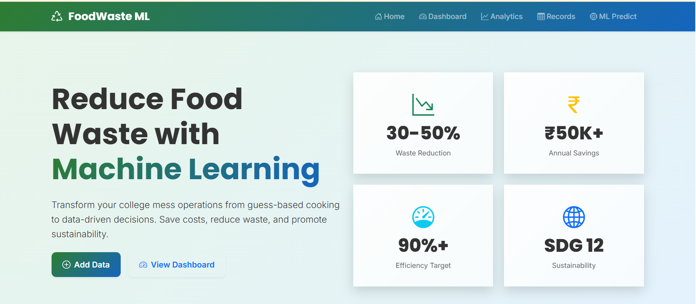
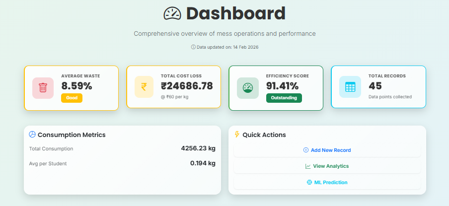
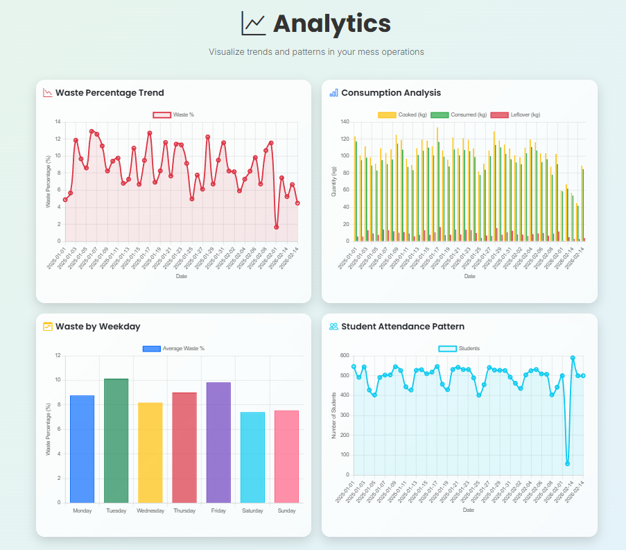
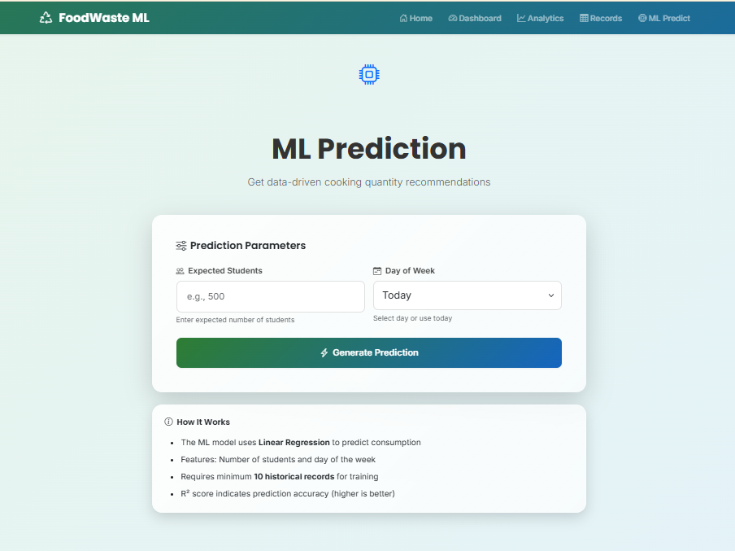

# 🍽️ WasteLess - ML-Based Food Waste Optimization System

> **Transform college mess operations from guess-based cooking to data-driven decisions**

[](https://www.python.org/)
[](https://flask.palletsprojects.com/)
[](LICENSE)
[](https://sdgs.un.org/goals/goal12)

## 🔗 Quick Links

- **🌐 [Live Demo](https://web-production-e056.up.railway.app/)** - Try the application now!
- **📦 [GitHub Repository](https://github.com/15athira/WasteLess)** - View source code

## 📌 Problem Statement

In most college mess facilities, food is prepared using rough estimation, leading to:
- ❌ Excess food waste
- 💸 Financial losses
- 🌍 Environmental impact
- 📊 Lack of transparency

This system replaces guesswork with **machine learning predictions** to optimize cooking quantities and reduce waste.

---

## ✨ Features

### 📊 Data Management
- **Daily Record Entry**: Track date, students, cooked quantity, and leftover
- **CRUD Operations**: View, edit, and delete records
- **Automatic Calculations**: Consumption, waste %, efficiency score

### 📈 Analytics & Visualization
- **Waste Percentage Trend** (Line Chart)
- **Consumption Analysis** (Bar Chart)
- **Waste by Weekday** (Bar Chart)
- **Student Attendance Pattern** (Line Chart)

### 🤖 Machine Learning
- **Linear Regression Model** for consumption prediction
- **Features**: Number of students + Day of week
- **R² Score Display** for model accuracy
- **Recommended Cooking Quantity** with safety margin

### 🎨 Modern UI/UX
- Glassmorphism design effects
- Responsive layout (mobile, tablet, desktop)
- Color-coded performance indicators
- Smooth animations and transitions
- Bootstrap 5 + Custom CSS

---

## 🛠️ Tech Stack

| Component | Technology |
|-----------|-----------|
| **Backend** | Flask (Python) |
| **Database** | SQLite |
| **ML** | Scikit-learn (Linear Regression) |
| **Data Processing** | Pandas, NumPy |
| **Visualization** | Chart.js |
| **Frontend** | HTML5, CSS3, Bootstrap 5 |
| **Fonts** | Google Fonts (Inter, Poppins) |
| **Icons** | Bootstrap Icons |
| **Deployment** | Gunicorn, Render/Railway |

---

## 🚀 Installation & Setup

### Prerequisites
- Python 3.11 or higher
- pip (Python package manager)

### Step 1: Clone the Repository
```bash
git clone https://github.com/15athira/WasteLess.git
cd WasteLess
```

### Step 2: Create Virtual Environment
```bash
# Windows
python -m venv venv
venv\Scripts\activate

# macOS/Linux
python3 -m venv venv
source venv/bin/activate
```

### Step 3: Install Dependencies
```bash
pip install -r requirements.txt
```

### Step 4: Generate Sample Data (Optional)
```bash
python dataset.py
```

This creates `sample_data.csv` with 40 days of synthetic data.

### Step 5: Load Sample Data into Database
```bash
python -c "import sqlite3; import pandas as pd; conn = sqlite3.connect('mess_data.db'); df = pd.read_csv('sample_data.csv'); df.to_sql('records', conn, if_exists='replace', index=False); print('Sample data loaded successfully!')"
```

### Step 6: Run the Application
```bash
python app.py
```

Visit: **http://127.0.0.1:5000**

---

## 📖 Usage Guide

### 1. **Add Daily Record**
- Navigate to Home page
- Fill in: Date, Students, Cooked (kg), Leftover (kg)
- Click "Save Record"

### 2. **View Dashboard**
- See key metrics: Avg Waste %, Total Loss, Efficiency Score
- View recent records table
- Access quick actions

### 3. **Analyze Trends**
- Go to Analytics page
- View 4 interactive charts
- Identify patterns and improvement areas

### 4. **Get ML Prediction**
- Navigate to ML Predict
- Enter expected students and day
- Get recommended cooking quantity
- View model accuracy (R² score)

### 5. **Manage Records**
- Go to Records page
- Edit or delete existing entries
- View all historical data

---

## 🌐 Deployment

### Deploy to Render

1. **Create Render Account**: [render.com](https://render.com)

2. **Create New Web Service**
   - Connect your GitHub repository
   - Select branch: `main`
   - Build Command: `pip install -r requirements.txt`
   - Start Command: `gunicorn app:app`

3. **Environment Variables** (if needed)
   - `PYTHON_VERSION`: `3.11.7`

4. **Deploy**: Click "Create Web Service"

### Deploy to Railway

1. **Create Railway Account**: [railway.app](https://railway.app)

2. **New Project** → **Deploy from GitHub**

3. **Configure**:
   - Railway auto-detects `Procfile`
   - No additional configuration needed

4. **Deploy**: Automatic deployment on push

---

## 📊 Expected Impact

### Quantifiable Outcomes
- 🎯 **30-50% reduction** in food waste
- 💰 **₹50,000-₹1,00,000** annual savings (500-student mess)
- ⚡ **90%+ efficiency score** target
- 📈 **100% visibility** into operations

### Qualitative Benefits
- Data-driven decision making
- Environmental sustainability (SDG 12)
- Reduced carbon footprint
- Improved resource allocation
- Institutional accountability

---

## 🔮 Future Enhancements

- [ ] User authentication (admin/staff roles)
- [ ] Festival/event detection
- [ ] Seasonal modeling
- [ ] Real-time attendance integration
- [ ] Email/SMS notifications
- [ ] Advanced ML models (Random Forest, XGBoost)
- [ ] Multi-mess support
- [ ] Mobile app (Flutter/React Native)
- [ ] API for third-party integrations

---

## 📸 Screenshots

### Home Page
Modern landing page with hero section and data entry form


### Dashboard
Comprehensive metrics with color-coded performance indicators



### Analytics
Interactive Chart.js visualizations for trend analysis


### ML Prediction
Get data-driven cooking recommendations

---

## 🌍 Supporting SDG 12

This project directly contributes to **Sustainable Development Goal 12**: Responsible Consumption and Production

- **Target 12.3**: Halve per capita global food waste by 2030
- **Impact**: Reduce waste, save resources, promote sustainability

---

## 📄 License

This project is licensed under the MIT License.

---

## 👨‍💻 Author

Created with ❤️ for sustainable mess management

---

## 🙏 Acknowledgments

- Bootstrap team for UI framework
- Chart.js for visualization library
- Scikit-learn for ML capabilities
- Google Fonts for typography

---

## 📞 Support

For issues or questions:
- 🐛 [Create an issue on GitHub](https://github.com/15athira/WasteLess/issues)
- 💬 [Start a discussion](https://github.com/15athira/WasteLess/discussions)

---

**⭐ Star this repo if you find it useful!**
